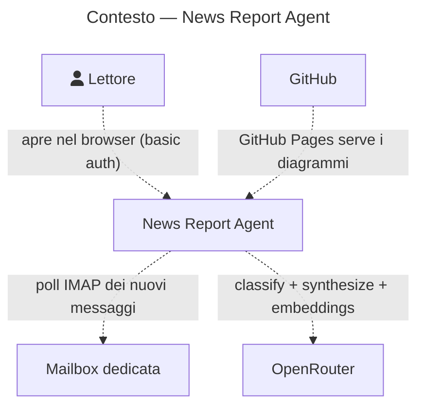
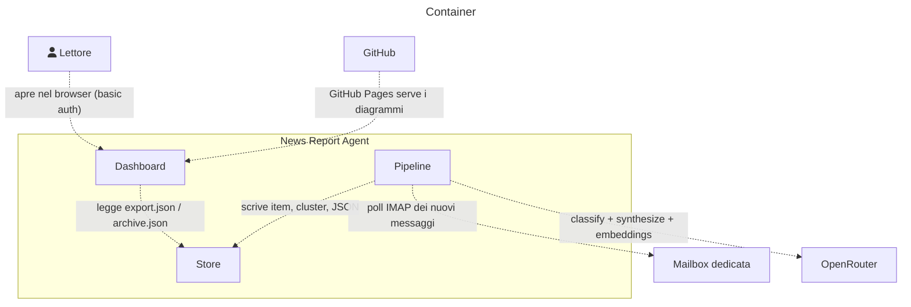
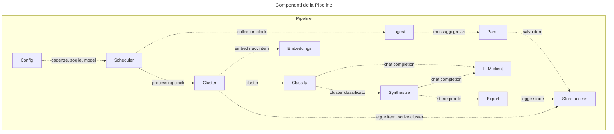
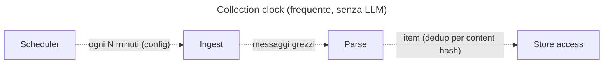
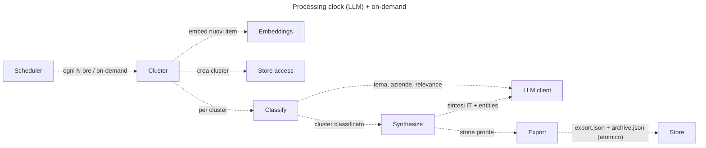

# Diagrammi architetturali

> Generato da LikeC4 (`docs/architecture/*.c4`) con `npm run docs:mermaid`. Non modificare a mano.
> Versione interattiva: https://fulviodeg.github.io/NewsReportAgent/

## Contesto (System Context)

## Container

## Componenti della Pipeline

## Dynamic — Collection clock

## Dynamic — Processing clock

