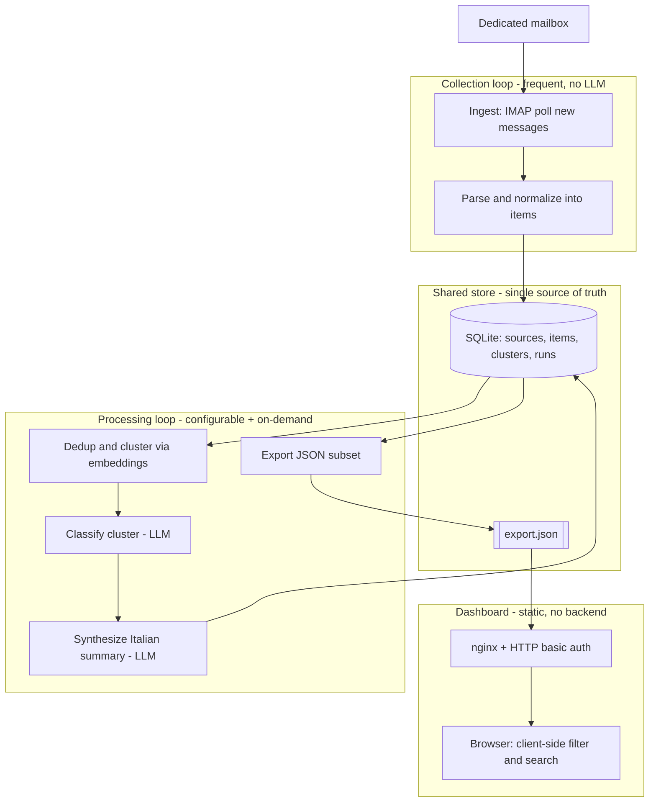

# News Report Agent — v1 Architecture

Version: v1 (2026-07-15). Status: design locked, ready to build.

This document describes the full v1 architecture of the News Report Agent: a system that ingests news from newsletters, classifies and synthesizes it with an LLM, and publishes a filterable, password-protected dashboard online. It records the decisions, the reasoning behind each one, and a verifiable definition of "done".

---

## 1. Overview and scope

### What it does
The system reads a stream of newsletter emails, turns each email into discrete news items, groups items that report the same story, uses an LLM to classify and summarize each story in Italian (technical terms kept in English), and publishes the result to a static web dashboard. A reader opens the dashboard, authenticates with a password, and filters and searches the news by theme, company, and source (testata). Each item links to its original source and shows the other sources that reported the same story.

### In scope for v1
- One source type: newsletters, read from a dedicated mailbox over IMAP.
- A processing pipeline: collect, parse, deduplicate and cluster, classify, synthesize, export, persist.
- A single "brain" LLM on OpenRouter for the classify and synthesize steps, one model for all LLM tasks, configurable per task.
- Embeddings for clustering (approach chosen below, flagged as a live decision).
- A static, data-driven dashboard served by nginx with HTTP basic auth, client-side filtering and search, and auto-refresh of an exported JSON file.
- SQLite as the single source of truth; a JSON subset exported for the dashboard.
- Two configurable schedules ("two clocks") plus an on-demand trigger.
- Packaging as Docker Compose on a VPS, code on GitHub, secrets via a gitignored `.env`.

### Deferred beyond v1 (evolution hooks, not built now)
- Additional sources: RSS, web scraping, X and other social feeds.
- Keyword and concept monitoring with real-time alerts.
- Audience-adaptive presentation (this is where content routing returns in a later version).
- A clickable glossary of technical terms (planned for v1.1).
- Cross-time trend linking and any self-improvement loop.
- Repurposing the collected news into a new outbound newsletter.

Section 11 explains how the v1 design leaves room for each of these.

---

## 2. Design principles

Each principle carries a plain-language rationale and a cited source.

**1. Workflow before agent.** The system is a fixed sequence of steps defined in code, not an autonomous agent that decides its own next action at runtime. The task is well understood and repeats the same way every run, so a predictable, testable, cheaper workflow fits better than a dynamic agent. Anthropic's guidance is to start with workflows and adopt an autonomous agent only when the task genuinely needs dynamic, model-driven decisions (Anthropic, *Building Effective Agents*). Nothing in v1 needs that.

**2. Simplicity first.** v1 adds a tool, a store, or a structural layer only when a simpler design fails. There is no agent framework, no message bus, no database server, no multi-agent structure. Plain Python plus SQLite plus nginx covers every v1 requirement. Anthropic and OpenAI both recommend the simplest design that works and adding complexity only when it earns its place (Anthropic, *Building Effective Agents*; OpenAI, *A Practical Guide to Building Agents*).

**3. Config-driven.** The newsletter list, the two cadences, the model used per task, and the numeric thresholds all live in a configuration file, separate from the logic. This lets the user tune behavior without editing code and keeps the pipeline reusable. This mirrors the separation of a stable instruction set from changeable operational parameters described in OpenAI, *A Practical Guide to Building Agents*.

**4. Separate deterministic execution from LLM judgment.** The steps that can be code are code: collect, parse, cluster, export, persist. The LLM is used only where genuine language judgment is required: classification and Italian synthesis. This keeps the reliable parts reliable and confines the non-deterministic, paid, slower steps to a narrow surface. This separation is the sound core of the DOE framework (Collin Wilkins, *Agentic Workflows Guide (DOE Framework)*) and is consistent with the workflow discipline in Anthropic, *Building Effective Agents*.

**5. The store is the single source of truth.** SQLite holds every collected item, cluster, classification, and run record. The three parts of the system communicate only through the store and the exported file. Any part can be restarted or rerun without the others, and reruns are safe because state lives in one place. This reflects the note-taking and durable-state practice in Anthropic, *Effective context engineering for AI agents*, applied at the system level rather than inside a single agent.

---

## 3. High-level architecture

The system has three independent parts that never call each other directly. They communicate only through the shared store (the SQLite file and the exported JSON).

1. **Collection** — a frequent, cheap loop. Poll the mailbox, parse new emails into items, write items to the store. No LLM.
2. **Processing** — a less frequent loop plus an on-demand trigger. Read new items from the store, deduplicate and cluster them, classify and synthesize each cluster with the LLM, write results back, and export the dashboard JSON.
3. **Dashboard** — a static site served by nginx behind basic auth. It loads the exported JSON in the browser and does all filtering and searching client-side.

This decoupling is the reason the design stays simple. Collection can run every few minutes without ever paying for an LLM call. Processing can run on its own slower cadence. The dashboard has no backend to fail; it reads a file. Each part can be developed, tested, restarted, and reasoned about on its own.



---

## 4. Components in detail

The pipeline is a fixed chain. Deterministic stages are code; two stages call the LLM. The chain is: collect, parse, dedup and cluster, classify, synthesize, export, persist. The LLM sub-chain (classify then synthesize) is exactly the prompt-chaining pattern from Anthropic, *Building Effective Agents*: a fixed sequence where each step consumes the previous step's output. It is wrapped by deterministic steps on both sides.

**1. Ingest (deterministic).** Connect to the dedicated mailbox over IMAP and fetch only messages newer than the last successful poll (tracked by UID or date in the store). Write raw messages, with sender, subject, received date, and a stable message id, to the store. The IMAP reader sits behind a small `IngestSource` interface so a webhook or RSS source can be added later without touching any downstream stage.

**2. Parse and normalize (deterministic; optional LLM for very messy emails).** Split each newsletter email into discrete news items, extracting a title, the item text, and the source link for each. Most newsletters have a consistent structure, so per-sender rules or generic HTML heuristics handle them deterministically. A narrow LLM fallback is allowed only for emails that resist deterministic parsing, and it stays behind a flag so it does not run by default. Each item is stored with a foreign key to its source email.

**3. Dedup and cluster (deterministic plus embeddings).** Compute an embedding for each new item and group items whose embeddings are highly similar within a bounded recent time window. A cluster represents one story; its members are the different sources that reported it. This step produces the "other sources reporting the same story" data for free. Cross-run dedup uses a stable content hash plus embedding similarity so the same item arriving twice, or a story continuing across runs, is handled without duplicates. The similarity threshold and the time window live in config.

**4. Classify (LLM).** For each cluster, call the LLM once to assign a theme, the companies mentioned, and a relevance or importance score. The response is parsed into a Pydantic model so a malformed or out-of-schema output is caught immediately and the item can be retried or skipped. Validating structured LLM output against a strict schema is the pattern behind Pydantic AI's typed outputs; here we apply the same discipline with plain Pydantic.

**5. Synthesize (LLM).** For each cluster, call the LLM to write the Italian summary, keeping technical terms in English and preserving the source links. The output is validated against a Pydantic model that requires the summary text and at least one source link. The synthesized text plus the cluster's source list is what the dashboard shows.

**6. Export (deterministic).** Write the "ready to show" data as a single JSON file: for each story, its Italian summary, theme, companies, sources with links, and timestamps. This file is the only thing the dashboard reads. Writing is atomic (write to a temp file, then rename) so the dashboard never reads a half-written file.

**7. Persist (deterministic).** SQLite holds the durable state across all runs. Suggested tables:
- `sources` — each newsletter sender or feed, with display name (testata).
- `items` — each parsed news item, with title, text, link, source id, content hash, embedding reference, and collected-at timestamp.
- `clusters` — each story, with member item ids, theme, companies, relevance, Italian summary, and processed-at timestamp.
- `runs` — one row per collection or processing run, with start and end time, counts, cost, and outcome, for observability and idempotency.

Persisting every run enables safe reruns, cross-run dedup, and the future trend analysis noted in Section 11.

---

## 5. Scheduling — the two clocks

Collection and processing run on two independent, configurable clocks, plus a manual trigger. Cadences live in config, never hardcoded.

- **Collection clock (frequent, cheap).** Polls the mailbox, parses, and stores. It touches no LLM, so running it often (for example every few minutes) costs almost nothing and keeps the store fresh.
- **Processing clock (configurable, paid).** Runs the dedup, cluster, classify, synthesize, and export stages. Because these stages call the LLM and cost money, this clock runs less often (for example a few times a day) and its cadence is the main cost and freshness dial.
- **On-demand trigger.** A manual command runs the processing chain immediately (for example after adding a newsletter or to refresh before a meeting). It uses the exact same code path as the scheduled run.

Decoupling the clocks means the user can collect aggressively and process economically, and can tune each dial independently once the system is in use. The scheduler runs inside the pipeline container (Section 10) and reads both cadences from config on startup.

---

## 6. Configuration

Configuration is a single human-editable file in the pipeline service. TOML is suggested for readability and comments; YAML is an equally acceptable alternative. Secrets never live here; they come from environment variables (Section 10).

What lives in config:
- **Newsletters / sources** — the list of expected senders, each with a display name (testata) and optional per-sender parse hints.
- **Cadences** — the collection interval and the processing interval (the two clocks).
- **Model per task** — the OpenRouter model id used for classify and for synthesize. In v1 both point to the same model; keeping them as separate keys lets the user split them later without a code change.
- **Thresholds** — clustering similarity threshold, clustering time window, relevance cutoff for what appears on the dashboard, and the cost cap (Section 8).
- **Embeddings** — the embeddings provider and model id (see Section 7).

Illustrative shape (values are examples, not fixed):

```toml
[cadence]
collection_interval_minutes = 5
processing_interval_minutes = 360   # every 6 hours

[llm]
provider = "openrouter"
model_classify = "TBD-model"        # live decision; one model in v1
model_synthesize = "TBD-model"      # same model in v1, separable later

[embeddings]
provider = "TBD"                    # live decision (see Section 7)
model = "TBD"

[clustering]
similarity_threshold = 0.82
window_hours = 72

[filters]
min_relevance = 0.3

[cost]
daily_usd_cap = 5.0

[[sources]]
name = "Example Testata"
from_address = "news@example.com"
```

---

## 7. LLM usage and model

**Which steps use the LLM.** Only classify and synthesize. Everything else is deterministic code. This is deliberate: it confines the paid, slower, non-deterministic surface to the two steps that need language judgment, in line with the separation principle (Section 2, principle 4).

**One configurable model on OpenRouter.** v1 routes both LLM steps through the OpenRouter API using one model, referenced by config keys per task so the user can later assign a cheaper model to classification and a stronger model to synthesis without touching code. The specific model is a **live decision**: model quality, price, and availability move quickly, so the user should verify current OpenRouter options at build time and set the config value then. The code must treat the model as a config value and never hardcode a name.

**Structured output.** Both LLM calls return data validated against a Pydantic schema. Classification returns theme, companies, and relevance. Synthesis returns the Italian summary and the preserved source links. A response that fails validation is retried a bounded number of times, then the single cluster is logged and skipped (Section 8).

**Embeddings for clustering.** Clustering needs an embedding per item. This is a separate concern from the brain LLM and sits behind its own small interface so it can be swapped. Recommended v1 default and its tradeoff:
- **Recommended:** a hosted multilingual embeddings model called directly (for example a current multilingual embedding model from a major provider). At newsletter volume the per-call cost is negligible, the Docker image stays small, and multilingual quality handles Italian well.
- **Alternative:** a local multilingual sentence-transformers model running inside the container. This removes per-call cost and external dependency at the price of a much larger image and model weights to ship.
This choice is a **live decision**; either fits behind the same interface. The user picks based on the cost-versus-image-size tradeoff and whether Italian quality is acceptable.

**Rough cost sketch (order of magnitude, to be verified).** Assume roughly 10 to 30 newsletters per day yielding on the order of 20 to 60 stories per day after clustering. Two LLM calls per story (classify and synthesize) gives roughly 40 to 120 calls per day. With a mid-range model and short prompts plus summaries, this lands in the region of a few US dollars per day, which the cost cap bounds. Collection and clustering add negligible or near-zero LLM cost. These figures are a planning estimate; the user should measure real usage and tune the processing cadence and model choice accordingly.

---

## 8. Guardrails and operations

### Guardrails (built into v1)
- **Per-item isolation.** An LLM failure on one cluster never breaks the run. Each cluster is processed independently; a failure is logged, that cluster is skipped, and the run continues. This keeps one bad item from losing a whole batch.
- **Retry with backoff.** Transient errors (network, rate limit, timeout) are retried with exponential backoff. After a bounded number of identical failures the step stops and records the failure rather than looping forever.
- **Idempotency and cross-run dedup.** Reruns are safe. Content hashing plus embedding similarity prevent duplicate items and duplicate stories across runs, so re-running processing produces the same result rather than growing the data.
- **Configurable cost cap.** A daily spend threshold lives in config. When the running cost for a processing run would exceed the cap, the run stops and records an alert rather than continuing to spend.
- **Dashboard password.** The dashboard is behind HTTP basic auth at the nginx layer. Nothing is public.
- **Minimal observability.** Each run writes a `runs` row with counts, cost, timing, and outcome, and the pipeline logs to stdout so `docker logs` shows what happened. This is the minimum needed to see that the two clocks are firing and to catch failures.
- **No irreversible external action.** The system only reads a mailbox and publishes a dashboard. It sends nothing, deletes nothing external, and takes no irreversible action, so it needs no human-in-the-loop approval gate in v1. Human oversight is simply reading the dashboard.

These guardrails follow the production guidance in OpenAI, *A Practical Guide to Building Agents* (input and output checks, bounded behavior, safe failure) and Anthropic, *Building Effective Agents* (stop conditions and predictable workflows).

### DOE positioning
The DOE framework (Directive, Orchestration, Execution) is worth being explicit about, because the project reviewed its original framework file.

**Adopted from DOE:**
- The **separation principle** — deterministic scripts do the repeatable work, and narrow LLM steps do only the language judgment. This is exactly how v1 splits its pipeline (Section 2, principle 4).
- The **guardrail posture** — error handling with retry and backoff on transient errors, stopping after repeated identical failures, and cost-escalation thresholds that stop and alert above a configurable budget.

**Rejected from DOE:**
- The **runtime LLM-orchestrator model**. In DOE, an LLM reads directives at runtime and chooses which execution script to run next. v1 does the opposite: at runtime there is no LLM deciding which step to run. The sequence is fixed in code and the trigger is a schedule. v1 is an unattended batch workflow, so a runtime reasoning layer would add cost, latency, and non-determinism with no benefit. A runtime orchestrator could fit a future interactive query or analysis layer, not v1.

**Build-time versus runtime — the key distinction.** There are two very different documents that both look like a `CLAUDE.md`:
- A **build-time** `CLAUDE.md` governs the coding agent while it develops this system. It shapes how code gets written. See the deliverable `coding-agent-CLAUDE.md`.
- The **runtime architecture** is what this document describes: a fixed workflow with no LLM in the orchestration loop.

The original DOE framework file blurs these two. It is written like a build-time `CLAUDE.md`, yet it defines a runtime in which the LLM is a permanent orchestrator choosing scripts on every run. Keeping the two separate is deliberate here: the coding agent follows a lean build-time file (the Karpathy-derived rules), and the system it builds is a deterministic runtime workflow.

---

## 9. Success criteria (definition of done for v1)

v1 is done when every item below is verifiably true:

1. **Collection works.** Running the collection clock connects to the dedicated mailbox, fetches only new messages since the last poll, and stores parsed items. Re-running it immediately adds nothing new (idempotent).
2. **Parsing works.** A newsletter email is split into discrete items, each with a title, text, and source link, stored with a link to its source.
3. **Clustering works.** Items reporting the same story are grouped into one cluster, and the cluster exposes the list of sources reporting that story. Duplicates across runs are not created.
4. **Classification works.** Each cluster receives a theme, companies, and a relevance score, validated against a Pydantic schema. An invalid LLM response is retried then skipped without breaking the run.
5. **Synthesis works.** Each cluster has an Italian summary with technical terms in English and preserved source links, validated against a Pydantic schema.
6. **Export works.** A single JSON file is written atomically containing the ready-to-show stories with summary, theme, companies, sources and links, and timestamps.
7. **Dashboard works.** nginx serves the static site behind HTTP basic auth. The browser loads the JSON and filters and searches by theme, company, and testata, with working source links and the "other sources" list. The dashboard picks up a new export automatically.
8. **Two clocks work.** Collection and processing run on their own configured intervals, and the on-demand trigger runs the processing chain immediately via the same code path.
9. **Config-driven.** Changing a newsletter, a cadence, a model, or a threshold requires editing only config, not code.
10. **Guardrails hold.** A forced LLM failure on one cluster is logged and skipped while the run completes; transient errors retry with backoff; exceeding the cost cap stops the run and records an alert.
11. **Secrets are safe.** The repository contains `.env.example` and `.gitignore`; no real secret is committed; the app reads secrets from the environment.
12. **Deploys with Docker.** `docker compose up` starts both services sharing one volume, and the dashboard is reachable and password-protected.

---

## 10. Deployment

**Source.** The entire project lives in one GitHub repository (a monorepo with the pipeline and the web assets side by side).

**Runtime.** Docker Compose on the VPS runs two services that share one volume:
- **web** — nginx serving the static dashboard with HTTP basic auth.
- **pipeline** — the Python app with an internal scheduler that reads both cadences from config and runs the two clocks plus the on-demand trigger.

The shared volume holds the SQLite file and the exported JSON. The pipeline writes them; nginx serves the JSON read-only.

**Secrets.** The OpenRouter key, mailbox credentials, and dashboard password come from a `.env` file that is gitignored. The repository commits only `.env.example` documenting the required variables, plus a `.gitignore`. The basic-auth password file for nginx is generated at deploy time from the environment and is never committed.

**Suggested repository structure:**

```
ReportNewsAgent/
├── CLAUDE.md                  # coding-agent rules (from coding-agent-CLAUDE.md)
├── README.md
├── .gitignore
├── .env.example
├── docker-compose.yml
├── pipeline/
│   ├── Dockerfile
│   ├── requirements.txt
│   ├── config.toml            # cadences, sources, model-per-task, thresholds
│   └── src/
│       ├── main.py            # scheduler entrypoint: two clocks + on-demand
│       ├── config.py          # load and validate config
│       ├── ingest/
│       │   ├── base.py        # IngestSource interface (swappable)
│       │   └── imap_source.py
│       ├── parse.py           # email -> items
│       ├── embeddings.py      # embeddings provider interface
│       ├── cluster.py         # dedup + clustering
│       ├── llm.py             # OpenRouter client: retry/backoff, cost tracking
│       ├── classify.py        # LLM step (Pydantic-validated)
│       ├── synthesize.py      # LLM step (Pydantic-validated)
│       ├── export.py          # atomic JSON export
│       ├── store/
│       │   ├── db.py          # SQLite access
│       │   └── schema.sql     # sources, items, clusters, runs
│       └── models.py          # Pydantic schemas
│   └── tests/
├── web/
│   ├── nginx.conf             # static serving + basic auth
│   └── site/
│       ├── index.html
│       ├── app.js             # loads export.json, client-side filter/search
│       └── styles.css
└── data/                      # shared volume mount (gitignored): news.db, export.json
```

---

## 11. Evolution hooks

The v1 design leaves room to add the deferred features cheaply.

- **New sources (RSS, scraping, social).** The IMAP reader sits behind an `IngestSource` interface. A new source implements the same interface and writes items to the store. No downstream stage changes.
- **Real-time keyword and concept alerts.** The store already records every item and cluster. An alert feature reads new clusters against a watch list and sends a notification. This is the first feature that may justify adding a small backend, which the current no-backend dashboard intentionally leaves open.
- **Audience-adaptive presentation.** Synthesis is one step in the chain. Adding audience-specific output means inserting a routing step that dispatches to a different synthesis prompt per audience (the routing pattern from Anthropic, *Building Effective Agents*), reusing the same clusters.
- **Clickable glossary (v1.1).** Technical terms are already kept in English in the summaries. A glossary step can annotate terms during export, and the dashboard can render them as clickable, without changing the pipeline shape.
- **Cross-time trend linking.** The `clusters` and `runs` tables retain history, so a later trend feature can link stories across time without re-collecting anything.
- **Newsletter repurposing.** The synthesized, clustered stories are already structured data, so a later step can assemble a new outbound newsletter from them.

Each hook reuses the store as the integration point, which is why the "store as single source of truth" principle (Section 2, principle 5) pays off over time.
